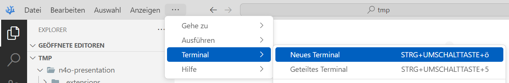
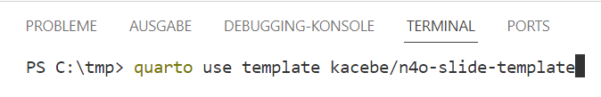

# Quarto-Template für NFDI4Objects-Präsentationen

## Sinn und Zweck

NFDI4Objects entwickelt eine Forschungsdateninfrastruktur für die materiellen Hinterlassenschaften der Menschheitsgeschichte. Die Initiative ist Teil der [Nationalen Forschungsdateninfrastruktur (NFDI)](https://www.nfdi.de/).

Eine wichtige Eigenschaft von Forschungsdaten ist deren [FAIRe](https://www.go-fair.org/fair-principles/) Bereitstellung, wofür die Reproduzier- und die Replizierbarkeit eine Voraussetzung ist.

Mit dem Template in diesem Repository können Präsentationen erstellt werden, die der Corporate Identity von NFDI4Objects entsprechen und die Funktionalitäten von *Quarto*, einem Open-Source-System für wissenschaftliche und technische Publikationen, bereitstellt. *Quarto* ermöglicht unter anderem:
- die Veröffentlichung von reproduzierbaren, publikationsreifen Artikeln, Präsentationen, Dashboards, Websites, Blogs und Bücher in HTML, PDF, MS Word, ePub und mehr.
- die Nutzung von Pandoc Markdown, einschließlich Gleichungen, Zitaten, Querverweisen, Abbildungsfeldern, Callouts, erweitertem Layout und mehr.
- das Erstellen dynamischer Inhalte mit Python, R, Julia und Observable.


## Voraussetzungen

Für die Nuztung des Templates muss Quarto auf dem Rechner installiert sein. Einen guten Einstieg bietet [das *Get Started*-Tutorial](https://quarto.org/docs/get-started/) auf der Website des Projekts.

Das n4o-slide-template wurde mit [VSCodium](https://vscodium.com/) und der [Extension for the Quarto scientific and technical publishing system.](https://open-vsx.org/extension/quarto/quarto) entwickelt.

> [!NOTE]
Screenshots und Anleitung beziehen sich im folgenden auf VSCodium mit Quarto-Erweiterung.

## Installation des Templates

1. Starten Sie VSCodium und öffnen Sie das Verzeichnis, in dem die Präsentation erstellt werden soll.
2. Öffnen Sie ein neues Terminal



3. Geben Sie folgenden Befehl ein:
```bash
quarto use template kacebe/n4o-presentation
```



Beantworten Sie die Fragen in der Konsole. Schließlich wird die Erweiterung installiert und eine Beispiel-`.qmd`-Datei erstellt, die Sie als Ausgangspunkt für Ihre Präsentation verwenden können.

Wenn Sie bereits eine Quarto-Präsentation in einer `.qmd`-Datei in dem Verzeichnis gespeichert haben und diese Vorlage darauf anwenden wollen, geben Sie diesen Befehl ein:

```bash
quarto add kacebe/n4o-presentation
```

### Updates

Das n4o-presentation-template wird wahrscheinlich weiter angepasst werden. Mit dem Befehl...

```bash
quarto update kacebe/n4o-presentation
```

... bleiben Sie auf dem neuesten Stand.

## Nutzung

Die Installation des Templates legt einige Dateien und Verzeichnisse an:

```
ROOT
|   .gitignore
|   example.qmd
|   README.md
|   template.qmd
|   
+---img
|       vscodium_terminal_01.png
|       vscodium_terminal_02.png
|       
\---_extensions
    \---n4o-presentation
            favicon.html
            n4o_bg.png
            n4o_logo.ico
            n4o_logo_kurztitel.png
            n4o_presentation.scss
            n4o_titleslide_bg.png
            _extension.yml
```

Für die Erstellung einer eigenen Präsentation sind lediglich Anpassungen in der Datei `template.qmd` notwendig. Es macht Sinn, dieser Datei einen sprechenden Namen zu geben e.g. `n4o_[yyyymmdd]_[anlass]_[autor:in]`, also etwa `n4o_20240201_twg24-1-meeting_kcbruhn.qmd`. Stellen Sie aber auf jeden Fall sicher, dass die Dateiendung `.qmd` erhalten bleibt.

## Metadaten

In der Datei `template.qmd` sind in den ersten Zeilen Metadaten angegeben. Einige werden direkt in die Präsentation übernommen. Passen Sie inbesondere folgende Felder an:

| Feld  | Anmerkungen  |
|---|---|
| title | Titel der Präsentation |
| subtitle | Untertitel |
| author  | Aktualisieren Sie die Angaben in der Aufzählung oder löschen Sie Zeilen, etwa wenn keine E-Mail-Adresse angegeben werden soll. Sie können auch weitere Autoren nach dem vorgegebenen Schema hinzufügen. Achten Sie auf die Einrückungen.  |
| date | Standardmäßig wird das aktuelle Datum eingefügt. Sie können hier auch ein statisches Datum nach dem Muster YYYY-MM-DD eintragen, e.g. `2024-02-26` |
|`property="og:title" content="Titel"` | Ersetzen Sie `Titel` mit dem Titel der Präsentation. |
| `property="og:description" content="Beschreibung"` | Ersetzen Sie `Beschreibung` mit auführlichen Informationen über die Präsentation.  |
| `property="og:url" content="URL zur Präsentation"` | Ersetzen Sie `URL zur Präsentation` mit der http(s)-Adresse der Folien  |
| `property="og:locale" content="de_DE"` |  |


## Beispiel

Die Beispielpräsentation, in der auch die wichtigsten Funktionen für Quarto-Präsentationen erläutert sind, finden Sie in der [example.qmd](example.qmd).

Alle Möglichkeiten der Gestaltung von Inhalten sind in der [Quarto-Dokumentation](https://quarto.org/docs/presentations/revealjs/#overview) hinterlegt.

## Aknowledgements

Diese Vorlage ist inspiriert von:

- [Altmeyer, Patrick. 2023. “Quarto on Steroids: Advanced Customization Through Quarto Extensions.” January 16, 2023.](https://www.paltmeyer.com/blog//blog/posts/)quarto-extensions. 
- https://github.com/hrbrmstr/quarto-organization-template
- https://github.com/beatrizmilz/quarto-rladies-theme/
- https://github.com/mcanouil/quarto-revealjs-storybook/
